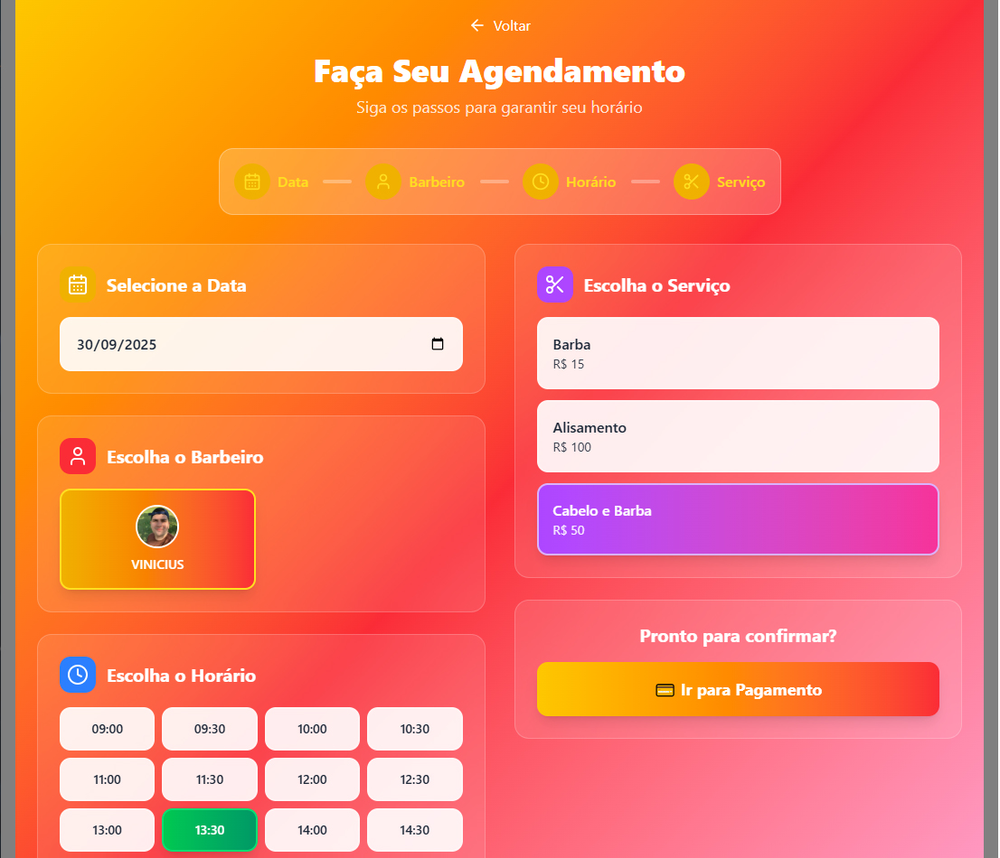
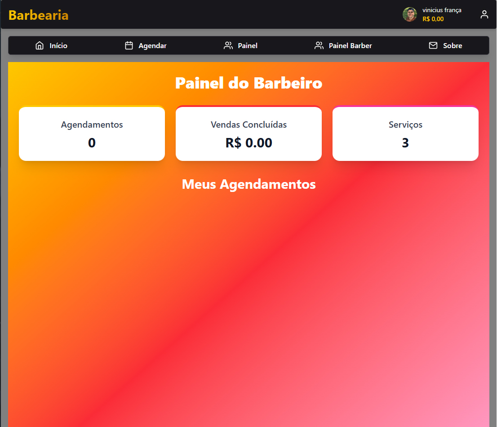
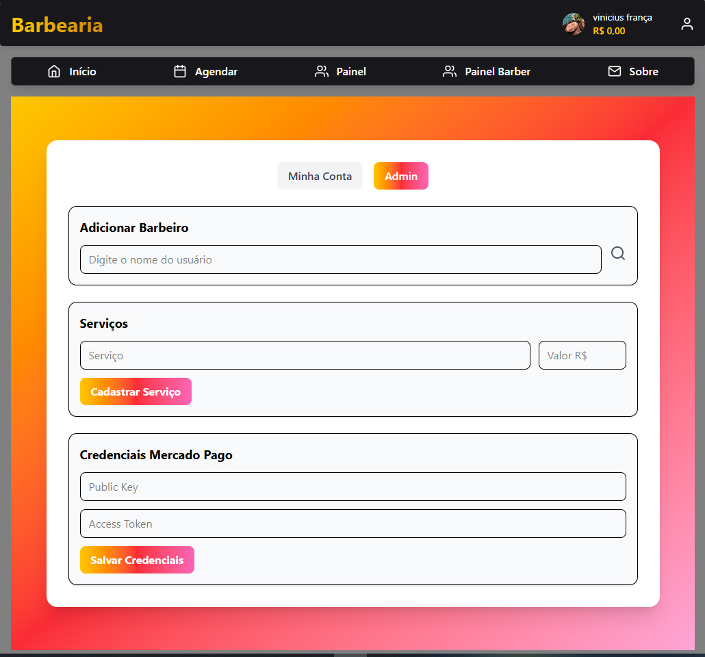
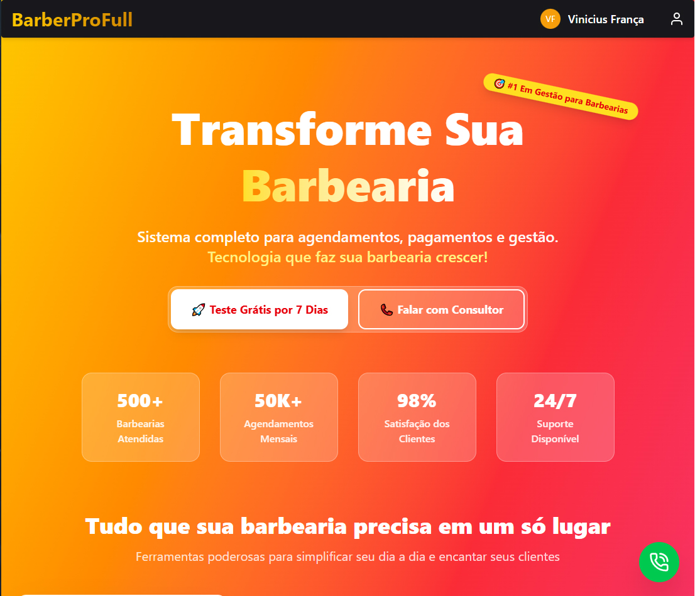
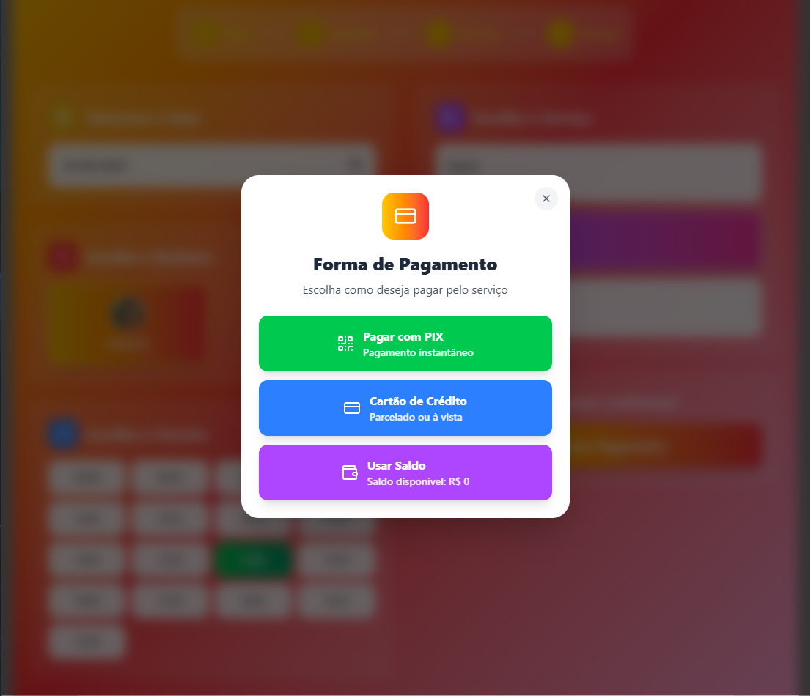
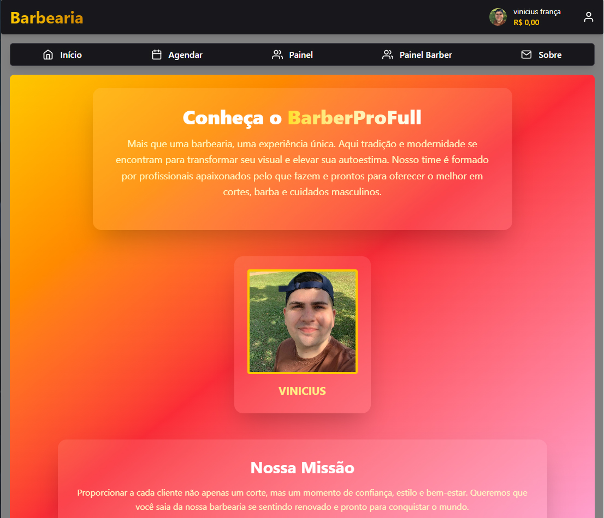

# BarberProFull

Sistema completo de **gestão de barbearias** desenvolvido com foco em performance, escalabilidade e experiência do usuário.  
Projeto pensado como **SaaS**, permitindo que múltiplas barbearias utilizem a plataforma de forma independente.

---

## Visão Geral

O BarberProFull é uma solução moderna para barbearias que desejam digitalizar seus processos, oferecendo:

- Agendamento online
- Gestão de barbeiros
- Controle de horários ocupados
- Sistema de pagamentos
- Estrutura multiempresa (multi-tenant)
- Integração com WhatsApp

Tudo em uma única plataforma.

---

## Tecnologias Utilizadas

- React  
- Tailwind CSS  
- Firebase (Auth, Firestore, Functions)  
- Integração com API de WhatsApp  
- Pagamentos via Pix e Cartão de Crédito  

---

## Principais Funcionalidades

### Agendamentos
- Agendamento de serviços em tempo real  
- Controle de dias e horários ocupados  
- Visualização por barbeiro  

---

### Gestão de Barbeiros
- Adicionar e remover barbeiros  
- Controle de agenda individual  
- Painel exclusivo para barbeiros  

---

### Painel Administrativo
- Gestão completa da barbearia  
- Controle de usuários e serviços  
- Visão geral do negócio  

---

### Sistema SaaS (Multi-Tenant)
- Cada barbearia possui seu próprio ambiente  
- Separação de dados por subdomínio  
- Clientes podem contratar a plataforma para sua barbearia  

---

### Pagamentos
- Sistema de saldo interno  
- Pagamentos via Pix  
- Pagamentos via Cartão de Crédito  

---

### Integrações
- API de WhatsApp para notificações e comunicação com clientes  
- Login e gerenciamento de contas  

---

### Páginas Institucionais
- Página “Sobre”  
- Estrutura pronta para expansão  

---

## Observação Importante

Este repositório contém **apenas imagens e documentação** do projeto.  
O código-fonte não está público por conter regras de negócio, integrações sensíveis e credenciais privadas.

---

## Status do Projeto

Projeto funcional e em produção, desenvolvido com foco em:
- Escalabilidade
- Segurança
- Experiência do usuário

---

## Autor

**Vinicius França**  
Desenvolvedor Front-End  
React • Tailwind CSS • Firebase • MercadoPago
